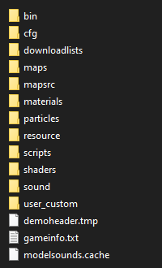

title: Guide - Install NT;RE (Client)

# Guide - Install NT;RE (Client)
Last Updated: 2025-03-06

## Operating System Requirement

Only Windows and Linux is supported. Generally aimed to work with
Windows 10+ and any Linux distros that works with the SteamRT
3.0 "sniper" runtime. [This document](https://gitlab.steamos.cloud/steamrt/steam-runtime-tools/-/blob/main/docs/distro-assumptions.md)
gives a comprehensive rundown on SteamRT's assumptions on Linux.
On Linux, NT;RE is supported natively. Running it through Proton
is not supported by NT;RE.

## Original NEOTOKYO Assets

NT;RE relies on (original) NEOTOKYO's assets to function. On Steam, just
download and install [NEOTOKYO](steam://rungameid/244630) regardless of Windows
or on Linux. Later when NT;RE starts up, it will try to find those files
automatically if possible and mounts them.

## Source SDK 2013 Multiplayer

Install [Source SDK Base 2013 (MP) Multiplayer](steam://rungameid/243750) (AppID: 243750)

## Downloading NT;RE

Click on the following links to download the zip files:

<div id="downloading-ntre-div">
    <noscript>
        <p>Sorry, Javascript is required to generate the download links.</p>
        <p>
            If you don't want to enable Javascript, see the download links manually from:
            <a href="https://github.com/NeotokyoRebuild/neo/releases">https://github.com/NeotokyoRebuild/neo/releases</a>
        </p>
    </noscript>
    <script type="text/javascript" src="/releases.js"></script>
</div>

For other versions, go to the [GitHub release](https://github.com/NeotokyoRebuild/neo/releases/) page and find the
version you want and expand the "Assets" section. You only need to install a zip file that ends with
`resources.zip` and for Windows: `libraries-Windows-Release.zip` or Linux: `libraries-Linux-Release.zip` for
the binaries zip file themselves. Usually those three zip files will be located at the bottom of the list above
the source code. The rest can be ignored as they're for developers or server operators.

## Installing NT;RE

Locate the `sourcemods` directory. Assuming the default installation paths
(adjust if needed if Steam is installed elsewhere):

* Windows: `C:\Program Files (x86)\Steam\steamapps\sourcemods`
* Linux: `$HOME/.steam/steam/steamapps/sourcemods`

Extract `...-resources.zip` first, there should be a directory called `neo`
in the `sourcemods` directory now along with NT;RE's specific assets.

Then `...-libraries-[Windows/Linux]-Release.zip` from the location of the
`sourcemods` directory. This should extract the binaries in `neo/bin`.

## Loading NT;RE

Open (or restart) Steam then "Neotokyo: Rebuild" should popup as an installed
game. From here, just startup the game and it could go fine generally for
standard setups. However if you have issues... 

## Troubleshooting

### Cannot join VAC servers

The client loads up in insecure mode by default, which will get blocked by
servers running VAC. To get VAC loading, open up "Properties..." then
launch options and set:

```
-steam
```

### Linux - Force SteamRT 3.0

This is not required, however if you want to make NT;RE run under the
SteamRT 3.0 runtime:

Ensure ["Steam Linux Runtime 3.0 (sniper)"](steam://rungameid/1628350) is installed, then
set the launch options:

```
steam-runtime-launch-options -- %command%
```

When NT;RE is launched, a Window with options should popup. On the top
"Container runtime" option change from "None" to "sniper 0.YYYYMMDD.VERSION"
then click "Run". This will popup everytime NT;RE is started through Steam.

### Could not load library client. Try restarting. If that doesn't work, verify the cache.

#### Windows

[Double check the contents](#installing-ntre) of your installation folder, you probably did not extract folders/files properly or are missing some all together. Make sure you have downloaded the necessary libraries and resource files from the "Assets" section of the latest release. Down below is an image of how your installation folder should look like:



